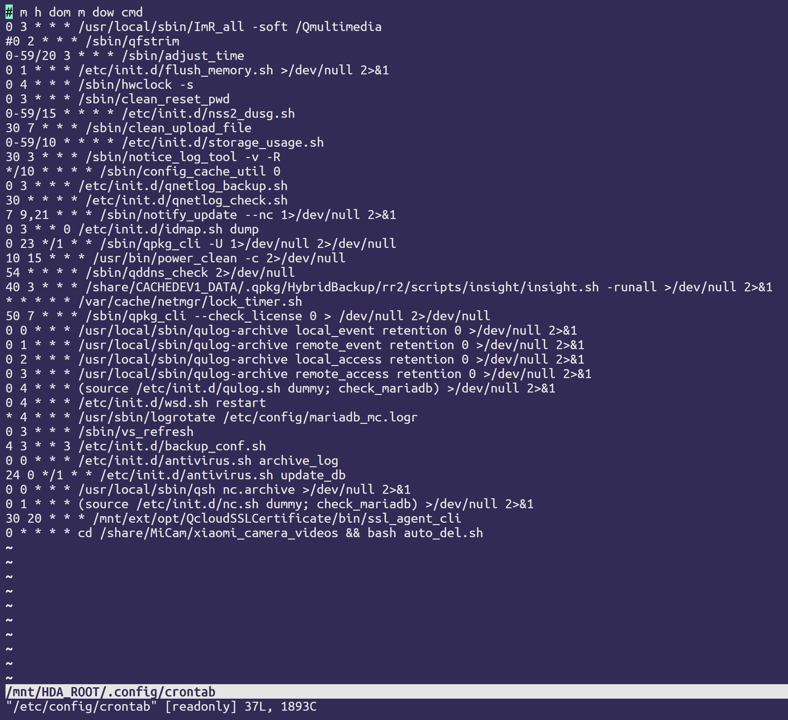
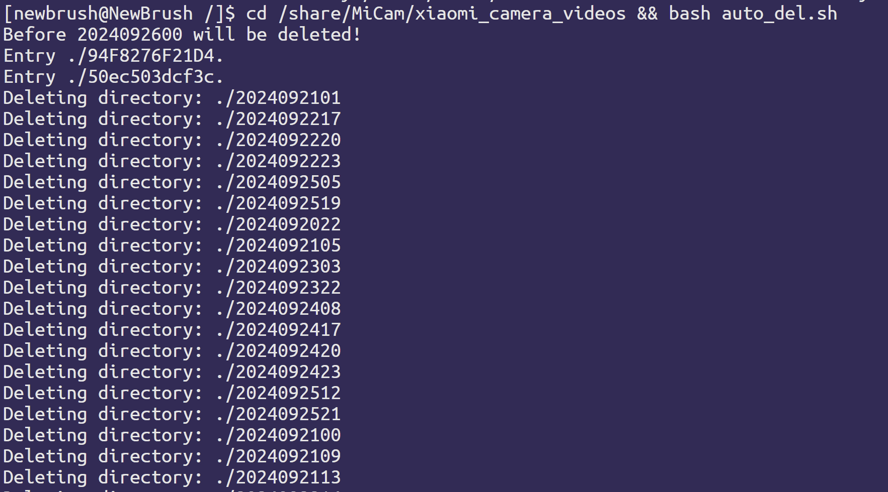
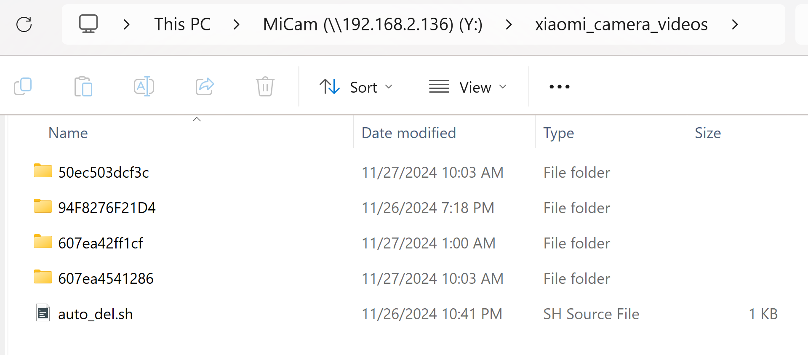

# QNAP_MI_CAM

去年8月29日在京东下单了一个QNAP威联通的TS-216，替换掉我家原来自己用树莓派3B+（Ubuntu Server + Samba）搭建的NAS。装了两个东芝P300 2TB的硬盘，开始组的RAID 1。后来发现家里面四五个摄像头每天的数据量大得很，没几天就把硬盘写满了。后面想想RAID 1不实在，家里没啥重要数据，今年回家的时候就格盘换成RAID 0了。但是米家摄像头数据还是很大，没几个月3.6TB就快写满了。

于是在米家APP中找到了视频存储时长设置选项，改成3个月：


<i>米家APP中视频存储时长设置选项</i>

改了之后NAS上面数据一点没动，应该是不会删除NAS上面的视频数据，所以就想着让NAS怎么自动删除米家摄像头三个月前的视频文件。

(以下所有操作需提前在NAS中开启SSH服务)

首先想到的是用`crontab`，但是QNAP的Linux系统是基于BusyBox的，`crontab -e` 这种命令有，但是不会运行成功，即便是加上 `sudo` ，也不能保存计划任务。


所以只能使用 `vi` 命令编辑计划任务文件，文件路径是 `/etc/config/crontab` ，在文件末尾加上：

```shell
0 * * * * cd /share/MiCam/xiaomi_camera_videos && bash auto_del.sh
```



这个命令的意思是每小时执行一次 `auto_del.sh` 脚本，脚本内容如下：

```shell
#!/bin/bash

# Set the base directory where random directories are located
base_directory="./"

# Calculate the date threshold for deletion (3 months ago)
date_threshold=$(date --date='-3 months' +'%Y%m%d00')

echo "Before $date_threshold will be deleted!"

# Find all random directories and process them
find "$base_directory" -maxdepth 1 -type d -name '[0-9a-f]*' | while read -r dir; do
  # Change directory to the random directory
  cd "$dir" || continue  # Skip if directory change fails
  echo "Entry $dir."

  # Find and delete directories older than the threshold
  find . -maxdepth 1 -type d -name '??????????' | while read -r subdir; do
    if [[ "$(basename "$subdir")" -lt "$date_threshold" ]]; then
      echo "Deleting directory: $subdir"
      rm -rf "$subdir"  # Remove the directory recursively
    fi
  done

  # Change back to the base directory
  cd ..
done
```

手动运行结果如下：



因为米家摄像头会在设置的文件夹下创建 `xiaomi_camera_videos` 文件夹，然后在这个文件夹下以设备序列号（？）创建的很像乱码的文件夹，每个乱码文件夹下面又以`年月日时`为名的文件夹，所以这个脚本的作用是删除 `xiaomi_camera_videos/??????????` 文件夹下三个月前的视频文件夹。所以脚本必须放在 `/目标文件夹/xiaomi_camera_videos`下：


